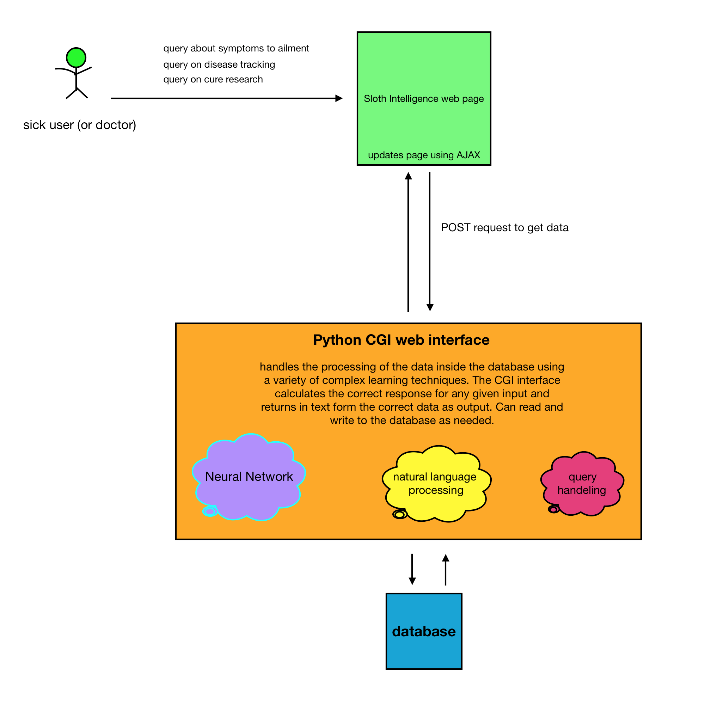

# slothintelligence

###General overview of the project
The general idea is to make a website that can assist with diagnosing, predicting, and curing diseases in real time; to make a new worldwide movement dedicated to curing the worlds problems, before people die. Eventually, the site will be able to control the health of the entire world, imagine new cures, and more properly utilize existing ones.

[link to the current site](http://www.unertech.com/secret_projects/sloth%20intelligence/hello.py)

### the details
Ok so the general idea is great, but how's it actually work?

A user makes a request by going to our site and typing stuff into some field. This could be a doctor sending data to be analyzed, a sick user looking for a cure, or a world power looking for a better way to help their people. Whatever the request is, they simply need to navigate to the correct area on our webpage (which is currently being developed using bootstrap). 

This request activates a javascript function, which sends a call via a POST request (sending data to a website with a payload of some data) to our python CGI page. This CGI page is written using Python and can compute the solution to any problem. It can utalize our neural network library, as well as other machine learning algorithms. The website sends the data back in text form. It can send nearly any amount of data, in any format needed.

The data is recieved by the websites script and then the page is updated using AJAX. No reloading is required.

The following image lays out the groundwork of how the site works.

### how the neural network works
this part is coming later...

### what should i do with all the weird python magical weird stuff devin claims is working?
Well first off, its only half working, it needs some fine tuning. Dont worry if it doesnt work super great now, it just needs more data and some work done.

Second... In the final version of the site (the one thats posted to the server) there has to be the python files and the javascript files and all that. But then in the HTML code of the site, all you need to worry about is that there are three things:

1. a button that the user clicks to get their results, this button should, when pressed, call the javascript function that gets the results
2. some feild where the user types their symptoms in, this should have some id, doesnt matter what it is but calling it "symptoms" would be nice
3. somewhere for the users data to be written to, when the results come back, there should be somewhere for them to be displayed. For now just make a text area where the results will be written to but later on this can be made to look super sci fi and fancy

An example of all of this is in the folder "simple example on the interface". This should provide a simple, easy example on how to use the current API. The html code can be changed and added to however we want, just dont touch the python or javascript too much.
##### NOTE:
You can NOT just try to do a preview of this site in browser, it needs a CGI compatable web server in order to run, which we do have, currently on devins personal site. If you want to test out the example code, look [here](http://unertech.com/secret_projects/python%20to%20JS%20AJAX/interface.html)
